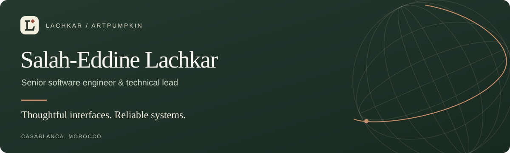

  <a href="https://lachkar.me"><strong>Portfolio ↗</strong></a>&nbsp;&nbsp; · &nbsp;&nbsp;
  <a href="https://lachkar.me/Salah_Eddine_Lachkar_CV.pdf"><strong>Download CV</strong></a>&nbsp;&nbsp; · &nbsp;&nbsp;
  <a href="https://www.linkedin.com/in/salah-eddine-lachkar/"><strong>LinkedIn</strong></a>&nbsp;&nbsp; · &nbsp;&nbsp;
  <a href="mailto:lachkar.salah@outlook.com"><strong>Get in touch</strong></a>

### Hi, I'm Salah.

I'm a **senior software engineer and technical lead** based in **Casablanca, Morocco**. I build full-stack web applications, connect the systems behind them, and help teams turn ideas into working products.

My work spans trading platforms, Web3 applications, desktop tools, and creative coding. I progressed from junior to senior software engineering and technical leadership, while staying hands-on with **React, Next.js, TypeScript, and Node.js**.

### Open-source projects

A selection of personal projects, from desktop engineering to creative coding.

| Project | What you can explore |
| :--- | :--- |
| **[Mosaic](https://github.com/artpumpkin/mosaic-desktop)** | A Tauri/Rust desktop workspace for finance, health, media, calls, and local tools—with an embedded mpv player. |
| **[Portfolio & chess](https://github.com/artpumpkin/portfolio)** | Next.js and Three.js, accessible chess interaction, offline support, and desktop/mobile browser tests. |
| **[Quaternion Spiral](https://github.com/artpumpkin/quaternion-spiral)** | An interactive spherical-spiral experiment using quaternions, React, and Three.js. |
| **[Intcode Computer](https://github.com/artpumpkin/intcode-computer)** | A resumable JavaScript virtual machine, sparse memory, a CLI, and execution-boundary tests. |
| **[Canvas Clock](https://github.com/artpumpkin/canvas-clock)** | A small dependency-free Canvas project with accessible controls and high-density rendering. |

### Work with context

| Project | My contribution |
| :--- | :--- |
| **[MRPNL](https://mrpnl.com)** | Full-stack engineering and project management for a trading education platform: administration, content, learning progress, and invoice workflows. |
| **[TickTickTrader](https://tickticktrader.com)** | Technical advisor → technical lead (March 2023–April 2026). Built administration interfaces, backend integrations, and market tools; led a team of approximately seven. |
| **Chain Pixel Labs** | Junior → senior software engineer / technical lead. Built Web3 applications and led approximately three people. Main role: October 2021–March 2023; occasional support through January 2024. |
| **[Idescape](https://idescape.com)** | Agency website development with responsive layouts, accessible interactions, form validation, and deployment. |
| **[SAFAR](https://arabic.emi.ac.ma/safar/index.html)** | Master's research project with EMI (2020–2021): React/Chakra UI frontend, English/Arabic and right-to-left layouts, data exports, speech input, PWA features, and comparison of Python Arabic NLP tools. |
| **[Personal portfolio](https://lachkar.me)** | Next.js portfolio with an interactive Three.js robotic arm, a still-image fallback, reduced-motion support, and offline access. |

More projects and the story behind them are on **[my portfolio](https://lachkar.me/#work)**.

### Tools I work with

| Interfaces | Systems | Quality & delivery |
| :--- | :--- | :--- |
| React · Next.js · TypeScript | Node.js · NestJS · Express | Vitest · Jest · Playwright |
| Tailwind CSS · Chakra UI · shadcn/ui | PostgreSQL · MongoDB · Prisma | Docker · GitHub Actions |
| Zustand · TanStack Query · Zod | REST APIs · Tauri · SQLite | Figma · AI-assisted development |

### Beyond the day job

I explore **Three.js and Canvas**, build desktop tools, and create reusable AI workflows.

### Education

- **Master in Data Science & Big Data** — Hassan II University, Casablanca · 2019–2021
- **Bachelor in Mathematics & Computer Science** — Hassan II University, Casablanca · 2018–2019

---

  <strong>Have a role or a project in mind?</strong> 
  <a href="mailto:lachkar.salah@outlook.com">lachkar.salah@outlook.com</a> · <a href="https://lachkar.me">lachkar.me</a>

